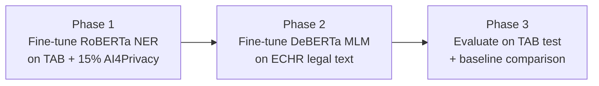

# TAB Fine-Tuning: Walkthrough

## What Was Built

Two files created in [tab-finetuning/](file:///home/ayush/Desktop/sem6/inlp/project/pii_identification_and_replacement/tab-finetuning):

| File | Purpose |
|------|---------|
| [tab_finetune.ipynb](file:///home/ayush/Desktop/sem6/inlp/project/pii_identification_and_replacement/tab-finetuning/tab_finetune.ipynb) | **Kaggle notebook** — upload and run directly |
| [tab_finetune.py](file:///home/ayush/Desktop/sem6/inlp/project/pii_identification_and_replacement/tab-finetuning/tab_finetune.py) | Equivalent Python script (source of truth) |

## 3-Phase Architecture

### Phase 1 — Masker NER Fine-Tuning
- Loads TAB from HuggingFace, converts char-level spans → word-level BIO tags
- Maps TAB's 8 types → AI4Privacy's 21 labels (e.g., `PERSON→FULLNAME`, `LOC→LOCATION`)
- Mixes **15% AI4Privacy rehearsal data** to prevent catastrophic forgetting
- Starts from `Xyren2005/pii-ner-roberta` checkpoint (LR=1e-5, max_len=512)

### Phase 2 — Filler MLM Fine-Tuning
- Loads TAB documents, chunks into paragraphs for MLM training
- Continues from `Xyren2005/pii-filler-deberta-filler` (LR=1e-5, 5 epochs)
- Teaches the filler "legalese" vocabulary patterns

### Phase 3 — Evaluation
- Runs masker → filler pipeline on TAB test set
- Computes per-entity-type masker recall
- Prints a **baseline vs fine-tuned comparison table**

## Baseline to Beat (Zero-Shot)

| Entity Type | Baseline Recall |
|-------------|:--------------:|
| PERSON → FULLNAME | 0.971 |
| LOC → LOCATION | 0.873 |
| DATETIME → DATE | 0.816 |
| ORG → ORGANIZATION | 0.682 |
| CODE → ID_NUMBER | 0.622 |
| QUANTITY → NUMBER | 0.237 |
| DEM/MISC → OTHER_PII | ~0.07 |
| **Overall** | **0.776** |

## How to Run on Kaggle

1. Upload `tab_finetune.ipynb` to Kaggle
2. Enable **GPU T4 x2** accelerator
3. Set `PUSH_TO_HUB = True` and add your `HF_TOKEN` as a Kaggle secret if you want to push models
4. Run all cells — runtime ~2-3 hours total on T4

## Validation

- ✅ Python syntax verified (`py_compile` passes)
- ✅ Notebook structure validated (19 cells, properly formatted)
- ✅ Label mapping exactly matches existing [evaluate_tab.py](file:///home/ayush/Desktop/sem6/inlp/project/pii_identification_and_replacement/testing_approach2/evaluate_tab.py) TAB_TYPE_TO_PLACEHOLDER
- ✅ BIO label set matches original [kaggle_notebook.ipynb](file:///home/ayush/Desktop/sem6/inlp/project/pii_identification_and_replacement/pipeline_maskfill/kaggle_notebook.ipynb) (43 labels from 21 entity types)
